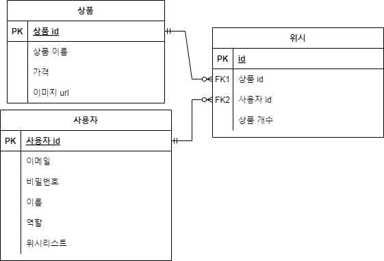

# spring-gift-jpa

### 기능 요구 사항
지금까지 작성한 JdbcTemplate 기반 코드를 JPA로 리팩터링하고 실제 도메인 모델을 어떻게 구성하고 객체와 테이블을 어떻게 매핑해야 하는지 알아본다.

- 객체의 참조와 테이블의 외래 키를 매핑해서 객체에서는 참조를 사용하고 테이블에서는 외래 키를 사용할 수 있도록 한다.

### DB 설계

```java
@OneToMany(mappedBy = "member") //Product 엔티티
private List<Wish> wishList;

@ManyToOne
@JoinColumn(name = "member_id", nullable = false) // Wish 엔티티
private Member member;

@ManyToOne
@JoinColumn(name = "product_id", nullable = false) // Wish 엔티티
private Product product;
```  

이렇게 연관관계를 매핑해주었다.