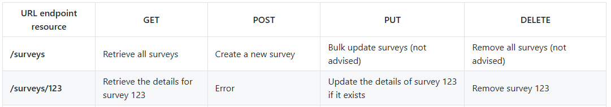

# spring-gift-product

## 프로그래밍 요구사항

-    자바 코드 컨벤션을 지키면서 프로그래밍한다.
-    -    기본적으로 Google Java Style Guide를 원칙으로 한다.
-    -    단, 들여쓰기는 '2 spaces'가 아닌 '4 spaces'로 한다.
-    indent(인덴트, 들여쓰기) depth를 3이 넘지 않도록 구현한다. 2까지만 허용한다.
-    -    예를 들어 while문 안에 if문이 있으면 들여쓰기는 2이다.
-    -    힌트: indent(인덴트, 들여쓰기) depth를 줄이는 좋은 방법은 함수(또는 메서드)를 분리하면 된다.
-    3항 연산자를 쓰지 않는다.
-    함수(또는 메서드)의 길이가 15라인을 넘어가지 않도록 구현한다.
-    -    함수(또는 메서드)가 한 가지 일만 잘 하도록 구현한다.
-    else 예약어를 쓰지 않는다.
-    -    else를 쓰지 말라고 하니 switch/case로 구현하는 경우가 있는데 switch/case도 허용하지 않는다.
-    -    힌트: if 조건절에서 값을 return하는 방식으로 구현하면 else를 사용하지 않아도 된다.

## 기능 요구 사항

### Step 1

상품을 조회, 추가, 수정, 삭제할 수 있는 간단한 HTTP API를 구현한다.

    HTTP 요청과 응답은 JSON 형식으로 주고받는다.
    현재는 별도의 데이터베이스가 없으므로 적절한 자바 컬렉션 프레임워크를 사용하여 메모리에 저장한다.



이 중 에러와 권장되지 않음에 해당하는 동작은 구현하지 않았다.


입력 : 
```HTTP
GET /api/products HTTP/1.1
```

출력 : 
```HTTP
HTTP/1.1 200 
Content-Type: application/json

[
  {
    "id": 8146027,
    "name": "아이스 카페 아메리카노 T",
    "price": 4500,
    "imageUrl": "https://st.kakaocdn.net/product/gift/product/20231010111814_9a667f9eccc943648797925498bdd8a3.jpg"
  }
]
```

힌트

현재는 별도의 데이터베이스가 없으므로 적절한 컬렉션을 이용하여 메모리에 저장한다.

```Java               
public class ProductController {
    private final Map<Long, Product> producsts = new HashMap<>();
    }

```

### Step 2
기능 요구 사항

상품을 조회, 추가, 수정, 삭제할 수 있는 관리자 화면을 구현한다.

    Thymeleaf를 사용하여 서버 사이드 렌더링을 구현한다.
    기본적으로는 HTML 폼 전송 등을 이용한 페이지 이동을 기반으로 하지만, 자바스크립트를 이용한 비동기 작업에 관심이 있다면 이미 만든 상품 API를 이용하여 AJAX 등의 방식을 적용할 수 있다.
    상품 이미지의 경우, 파일을 업로드하지 않고 URL을 직접 입력한다.

아래 예시와 꼭 같을 필요는 없으며, 가볍게 참고한다


### Step 3
자바 컬렉션 프레임워크를 사용하여 메모리에 저장하던 상품 정보를 데이터베이스에 저장한다.


## 클래스 설계
- [X] Product : 상품 정보 저장
- [X] ProductController : API
- [X] Application : Spring 어플레케이션 시작

### Step 2
- [X] AdminContoller : 상품 관리자 페이지

### Step 3
- [X] ProductDAO : h2 데이터에비스와 연결하여 상품 정보 저장(해시맵 대체)