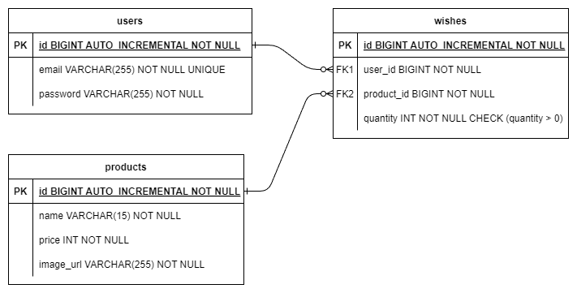

# spring-gift-jpa
## 3단계(페이지네이션) 요구사항

### 과제 진행 요구 사항

상품과 위시 리스트 보기에 페이지네이션을 구현한다.

- 대부분의 게시판은 모든 게시글을 한 번에 표시하지 않고 여러 페이지로 나누어 표시한다. 정렬 방법을 설정하여 보고 싶은 정보의 우선 순위를 정할 수도 있다.
- 페이지네이션은 원하는 정렬 방법, 페이지 크기 및 페이지에 따라 정보를 전달하는 방법이다.


### 힌트

이를 직접 구현할 수도 있지만, 스프링 데이터는 `Pageable`이라는 객체를 제공하여 쉽게 구현할 수 있다. 또한 `List`, `Slice`, `Page` 등 다양한 반환 타입을 제공한다.


#### 참고자료

- [Paging, Iterating Large Results, Sorting & Limiting](https://docs.spring.io/spring-data/jpa/reference/repositories/query-methods-details.html#repositories.special-parameters)
- [Pagination and Sorting using Spring Data JPA](https://www.baeldung.com/spring-data-jpa-pagination-sorting)
- [Converting List to Page Using Spring Data JPA](https://www.baeldung.com/spring-data-jpa-convert-list-page)


### 3단계 To-do

- [x] Product Pagination
- [ ] ~~User Pagination~~
  * user 전체에 대한 get 요청이 없으므로 해당 없음
  * 추후 회원 관리 등의 기능이 필요할 시 개발 예정
- [x] Wish Pagination


## 2단계(연관 관계 매핑) 요구 사항

### 기능 요구 사항

지금까지 작성한 JdbcTemplate 기반 코드를 JPA로 리팩터링하고 실제 도메인 모델을 어떻게 구성하고 객체와 테이블을 어떻게 매핑해야 하는지 알아본다.

- 객체의 참조와 테이블의 외래 키를 매핑해서 객체에서는 참조를 사용하고 테이블에서는 외래 키를 사용할 수 있도록 한다.


### 2단계 기능 목록



- [x] users - wishes 간 관계 연결
  * wishes 기준 ManyToOne
- [x] products - wishes 간 관계 연결
  * wishes 기준 ManyToOne

#### 결과

```sql
Hibernate: 
    create table products (
        price integer not null,
        id bigint generated by default as identity,
        name varchar(15) not null,
        image_url varchar(255) not null,
        primary key (id)
    )
Hibernate: 
    create table users (
        id bigint generated by default as identity,
        email varchar(255) not null unique,
        password varchar(255) not null,
        primary key (id)
    )
Hibernate: 
    create table wishes (
        quantity integer not null,
        id bigint generated by default as identity,
        product_id bigint not null,
        user_id bigint not null,
        primary key (id)
    )
Hibernate: 
    alter table if exists wishes 
       add constraint fk_wishes_product_id_ref_products_id 
       foreign key (product_id) 
       references products
Hibernate: 
    alter table if exists wishes 
       add constraint fk_wishes_user_id_ref_users_id 
       foreign key (user_id) 
       references users
```


---

## 1단계(엔티티 매핑) 요구 사항

### 기능 요구 사항

지금까지 작성한 JdbcTemplate 기반 코드를 JPA로 리팩터링하고 실제 도메인 모델을 어떻게 구성하고 객체와 테이블을 어떻게 매핑해야 하는지 알아본다.

- 아래의 DDL(Data Definition Language)을 보고 유추하여 엔티티 클래스와 리포지토리 클래스를 작성해 본다.
- `@DataJpaTest`를 사용하여 학습 테스트를 해 본다.

```sql
create table member
(
    id       bigint generated by default as identity,
    email    varchar(255) not null unique,
    password varchar(255) not null,
    primary key (id)
)
create table product
(
    price     integer      not null,
    id        bigint generated by default as identity,
    name      varchar(15)  not null,
    image_url varchar(255) not null,
    primary key (id)
)
create table wish
(
    id         bigint generated by default as identity,
    member_id  bigint not null,
    product_id bigint not null,
    primary key (id)
)
```

### 힌트

Spring Data JPA 사용 시 아래 옵션은 동작 쿼리를 로그로 확인할 수 있게 해준다.

```plaintext
spring.jpa.properties.hibernate.format_sql=true
spring.jpa.show-sql=true
```

[Auto-configured Data JPA Tests](https://docs.spring.io/spring-boot/docs/current/reference/htmlsingle/#features.testing.spring-boot-applications.autoconfigured-spring-data-jpa)

```java
@DataJpaTest
class StationRepositoryTest {
    @Autowired
    private StationRepository stations;
    
    @Test
    void save() {
        Station expected = new Station("잠실역");
        Station actual = stations.save(expected);
        assertAll(
                () -> assertThat(actual.getId()).isNotNull(),
                () -> assertThat(actual.getName()).isEqualTo(expected.getName())
        );
    }

    @Test
    void findByName() {
        String expected = "잠실역";
        stations.save(new Station(expected));
        String actual = stations.findByName(expected).getName();
        assertThat(actual).isEqualTo(expected);
    }
}
```

H2 데이터베이스를 사용한다면 아래의 프로퍼티를 추가하면 MySQL Dialect을 사용할 수 있다.

```plaintext
spring.datasource.url=jdbc:h2:mem:test;MODE=MYSQL;DB_CLOSE_DELAY=-1
spring.jpa.properties.hibernate.dialect=org.hibernate.dialect.MySQLDialect
create table member
(
    id       bigint       not null auto_increment,
    email    varchar(255) not null,
    password varchar(255) not null,
    primary key (id)
) engine=InnoDB

create table product
(
    price     integer      not null,
    id        bigint       not null auto_increment,
    name      varchar(15)  not null,
    image_url varchar(255) not null,
    primary key (id)
) engine=InnoDB

create table wish
(
    id         bigint not null auto_increment,
    member_id  bigint not null,
    product_id bigint not null,
    primary key (id)
) engine=InnoDB

alter table member
    add constraint uk_member unique (email)
```


### 1단계 기능 목록

- [x] 엔티티 매핑
  - [x] product
  - [x] member(이름 User 사용)
  - [x] wish
- [x] Repository 인터페이스
  - [x] product
  - [x] member(user)
  - [x] wish
- [x] 학습 테스트 작성
  - [x] ProductRepository
  - [x] UserRepository
  - [x] WishRepository


---


# 1주차 과제 요구사항(spring-gift-product)

## 1단계(상품 API) 요구 사항

### 과제 진행 요구 사항

* 미션은 선물하기 상품 관리 저장소를 포크하고 클론하는 것으로 시작한다.
* 온라인 코드 리뷰 요청 1단계 문서를 참고하여 실습 환경을 구축한다.
  1. 미션 시작 버튼을 클릭하여 미션을 시작한다.
  2. 저장소에 GitHub 사용자 이름으로 브랜치가 생성되었는지 확인한다.
  3. 저장소를 내 계정으로 포크한다.
* 기능을 구현하기 전 README.md에 구현할 기능 목록을 정리해 추가한다.
* Git의 커밋 단위는 앞 단계에서 README.md에 정리한 기능 목록 단위로 추가한다.
  * AngularJS Git Commit Message Conventions을 참고해 커밋 메시지를 작성한다.


### 기능 요구 사항

상품을 조회, 추가, 수정, 삭제할 수 있는 간단한 HTTP API를 구현한다.

* HTTP 요청과 응답은 JSON 형식으로 주고받는다.
* 현재는 별도의 데이터베이스가 없으므로 적절한 자바 컬렉션 프레임워크를 사용하여 메모리에 저장한다.

#### 예시

**Request**

```http
GET /api/products HTTP/1.1
```

**Response**

```http
HTTP/1.1 200 
Content-Type: application/json

[
  {
    "id": 8146027,
    "name": "아이스 카페 아메리카노 T",
    "price": 4500,
    "imageUrl": "https://st.kakaocdn.net/product/gift/product/20231010111814_9a667f9eccc943648797925498bdd8a3.jpg"
  }
]
```


### 1단계 기능 목록

> 패키지 분리 없이 단일 패키지로 진행. 단계를 진행하며 패키지 분리 리팩토링할 지 고려

**Product 클래스**

상품의 정보를 저장하는 객체

* 필드: `Long id`, `String name`, `int price`, `String imageUrl`
* 메서드
  * `public Product(Long id, String name, int price, String imageUrl)`


**ProductController 클래스 @RestController**

상품 조회, 추가, 수정, 삭제를 처리하는 엔드포인트 정의

* 엔드포인트
  * `GET /api/products`: 모든 상품 조회
  * `GET /api/products/{id}`: id를 통해 상품 조회
  * `POST /api/products`: JSON을 통해 새로운 상품 추가
  * `PUT /api/products/{id}`: 특정 id의 상품 수정
  * `DELETE /api/products/{id}`: 특정 id의 상품 삭제


**ProductService 클래스**

상품 조회, 추가, 수정, 삭제 기능을 실질적으로 처리하는 클래스

* 필드: `private final Map<Long, Product> products`: 상품 정보를 저장하는 저장소. <id, 상품>의 HashSet

* 메서드
  * `public List<Product> getAllProducts()`: 모든 상품 조회
  * `public Product getProductById(Long id)`: `id`를 통해 상품 조회
  * `public addProduct(Product product)`: 새로운 상품 추가
    * JSON 형식이 이상할 경우 에러 발생
  * `public Product updateProduct(Long id, Product product)`: id를 통해 상품을 검색한 후 상품 수정
    * 존재하지 않는 상품인 경우 예외 발생
  * `public void deleteProduct(Long id)`: 특정 id의 상품 삭제
    * 존재하지 않는 상품인 경우 예외 발생


---

## 2단계(관리자 화면) 요구사항

### 기능 요구 사항

상품을 조회, 추가, 수정, 삭제할 수 있는 관리자 화면을 구현한다.

- [Thymeleaf](https://www.thymeleaf.org/)를 사용하여 [서버 사이드 렌더링](https://joshua1988.github.io/vue-camp/nuxt/ssr.html)을 구현한다.
- 기본적으로는 HTML 폼 전송 등을 이용한 페이지 이동을 기반으로 하지만, 자바스크립트를 이용한 비동기 작업에 관심이 있다면 이미 만든 상품 API를 이용하여 [AJAX](https://developer.mozilla.org/ko/docs/Glossary/AJAX) 등의 방식을 적용할 수 있다.
- 상품 이미지의 경우, 파일을 업로드하지 않고 URL을 직접 입력한다.

 ### 2단계 기능 목록

> 각 페이지는 /src/resources/templates 경로에 저장

**product_list.html**

* 모든 상품을 리스트로 조회하는 메인 페이지
* 각 상품마다 update, delete 버튼 존재
  * update 버튼은 `product_add_form.html` 페이지로 이동
  * delete 버튼은 추가적인 조작없이 delete method 전송을 통해 삭제 후 메인 페이지 새로 고침
* 새 상품을 추가하는 버튼 존재
  * 버튼을 누르면 `product_edit_form.html` 페이지로 이동


**product_add_form.html**

* 새 상품을 추가하는 페이지
* 각 정보를 html 폼으로 입력받아 `POST /api/products`로 요청하여 저장


**product_edit_form.html**

* 상품을 수정하는 페이지
* 각 정보를 html 폼으로 입력받아 `PUT /api/products/{id}`로 요청하여 수정


## 3단계(데이터베이스 적용) 요구사항

### 3단계 기능 목록

#### 데이터베이스 구축

- [x] 기존 메모리 저장 로직 삭제
- [x] H2 데이터베이스 연결
- [x] `ProductService`의 기존 메서드들 DB 로직으로 대체
  - [x] `getAllProducts`
  - [x] `getProductById`
  - [x] `addProduct`
  - [x] `updateProduct`
  - [x] `deleteProduct`


### 기능 요구 사항

자바 컬렉션 프레임워크를 사용하여 메모리에 저장하던 상품 정보를 데이터베이스에 저장한다.

### 프로그래밍 요구 사항

- 메모리에 저장하고 있던 모든 코드를 제거하고 H2 데이터베이스를 사용하도록 변경한다.
- 사용하는 테이블은 애플리케이션이 실행될 때 구축되어야 한다.


---


## 1단계(유효성 검사 및 예외 처리) 요구사항

### 기능 요구사항

상품을 추가하거나 수정하는 경우, 클라이언트로부터 잘못된 값이 전달될 수 있다. 잘못된 값이 전달되면 클라이언트가 어떤 부분이 왜 잘못되었는지 인지할 수 있도록 응답을 제공한다.

- 상품 이름은 공백을 포함하여 최대 15자까지 입력할 수 있다.
- 특수 문자
  - 가능: ( ), [ ], +, -, &, /, _
  - 그 외 특수 문자 사용 불가
- "카카오"가 포함된 문구는 담당 MD와 협의한 경우에만 사용할 수 있다.


### 1단계 기능 목록

* 상품 추가 및 수정 기능에서의 유효성 검증
  * [x] 상품 이름은 공백을 포함하여 최대 15자까지 입력 가능
    * [ ] `InvalidProductNameException` 처리
  * [x] 유효한 특수 문자만 입력 가능 - 정규식 사용(`^[a-zA-Z가-힣0-9 ()\[\]\+\-\&/\_]*$`)
    * [ ] `InvalidProductNameException` 처리
  * [x] "카카오"가 포함된 문구가 입력된다면 예외 처리 후 클라이언트에게 안내
    * [ ] `RestrictedKeywordException` 처리
* Exception 및 ExceptionHandler 정의
  * [x] `InvalidProductNameException` 정의
  * [x] `RestrictedKeywordException` 정의
  * [x] ExceptionHandler 정의
    * [x] 상품 이름 길이에 관한 예외(`InvalidProductNameException`)
    * [x] 상품 이름 특수문자에 관한 예외(`InvalidProductNameException`)
    * [x] 특정 문구에 관한 예외(`RestrictedKeywordException`)


---

## 2단계(회원 로그인) 요구 사항

### 기능 요구 사항

사용자가 회원 가입, 로그인, 추후 회원별 기능을 이용할 수 있도록 구현한다.

* 회원은 이메일과 비밀번호를 입력하여 가입한다.
* 토큰을 받으려면 이메일과 비밀번호를 보내야 하며, 가입한 이메일과 비밀번호가 일치하면 토큰이 발급된다.
* 토큰을 생성하는 방법에는 여러 가지가 있다. 방법 중 하나를 선택한다.
* (선택) 회원을 조회, 추가, 수정, 삭제할 수 있는 관리자 화면을 구현한다.

아래 예시와 같이 HTTP 메시지를 주고받도록 구현한다.

사용자가 회원 가입, 로그인, 추후 회원별 기능을 이용할 수 있도록 구현한다.

- 회원은 이메일과 비밀번호를 입력하여 가입한다.
- 토큰을 받으려면 이메일과 비밀번호를 보내야 하며, 가입한 이메일과 비밀번호가 일치하면 토큰이 발급된다.
- 토큰을 생성하는 방법에는 여러 가지가 있다. 방법 중 하나를 선택한다.
- (선택) 회원을 조회, 추가, 수정, 삭제할 수 있는 관리자 화면을 구현한다.

아래 예시와 같이 HTTP 메시지를 주고받도록 구현한다.

#### 회원 가입

##### Request

```http
POST /members/register HTTP/1.1
content-type: application/json
host: localhost:8080

{
    "email": "admin@email.com",
    "password": "password"
}
```

##### Response

```http
HTTP/1.1 200
Content-Type: application/json

{
    "token": ""
}
```

#### 로그인

```http
POST /members/login HTTP/1.1
content-type: application/json
host: localhost:8080

{
    "email": "admin@email.com",
    "password": "password"
}
```

##### Response

```http
HTTP/1.1 200
Content-Type: application/json

{
    "token": ""
}
```

### 힌트

#### Basic 인증

Base64로 인코딩된 사용자 ID, 비밀번호 쌍을 인증 정보(credentials) 값으로 사용한다.

```html
Authorization: Basic base64({EMAIL}:{PASSWORD})
```

#### JSON Web Token

[JJWT](https://github.com/jwtk/jjwt) 라이브러리를 사용하여 JWT을 쉽게 만들 수 있다.

```java
dependencies {
    compileOnly 'io.jsonwebtoken:jjwt-api:0.12.6'
    runtimeOnly 'io.jsonwebtoken:jjwt-impl:0.12.6'
    runtimeOnly 'io.jsonwebtoken:jjwt-jackson:0.12.6'
}
String secretKey = "Yn2kjibddFAWtnPJ2AFlL8WXmohJMCvigQggaEypa5E=";
String accessToken = Jwts.builder()
    .setSubject(member.getId().toString())
    .claim("name", member.getName())
    .claim("role", member.getRole())
    .signWith(Keys.hmacShaKeyFor(secretKey.getBytes()))
    .compact();
```

#### 응답 코드

- Authorization 헤더가 유효하지 않거나 토큰이 유효하지 않은 경우 [`401 Unauthorized`](https://developer.mozilla.org/ko/docs/Web/HTTP/Status/401)를 반환한다.

> `401 Unauthorized` 클라이언트 오류 상태 응답 코드는 해당 리소스에 유효한 인증 자격 증명이 없기 때문에 요청이 적용되지 않았음을 나타냅니다. 이 상태는 WWW-Authenticate (en-US) 헤더와 함께 전송되며, 이 헤더는 올바르게 인증하는 방법에 대한 정보를 포함하고 있습니다. 이 상태는 `403`과 비슷하지만, `401 Unauthorized`의 경우에는 인증이 가능합니다.

- 잘못된 로그인, 비밀번호 찾기, 비밀번호 변경 요청은 [`403 Forbidden`](https://developer.mozilla.org/ko/docs/Web/HTTP/Status/403)을 반환한다.

> HTTP `403 Forbidden` 클라이언트 오류 상태 응답 코드는 서버에 요청이 전달되었지만, 권한 때문에 거절되었다는 것을 의미합니다. 이 상태는 `401`과 비슷하지만, 로그인 로직(틀린 비밀번호로 로그인 행위)처럼 반응하여 재인증(re-authenticating)을 하더라도 지속적으로 접속을 거절합니다.


### 2단계 기능 목록

- 회원 DTO 클래스 (User)
- 회원 관련 Controller
  - [x] `POST /api/members/register`: 회원가입
  - [x] `POST /api/members/login`: 로그인
- 회원 관련 Service
  - [x] 회원가입
  - [x] 로그인
- 회원 view
  - [ ] 회원가입
  - [ ] 로그인


---


# 2주차 과제 요구사항(spring-gift-wish)

## 3단계(위시 리스트) 요구 사항

### 기능 요구 사항

이전 단계에서 로그인 후 받은 토큰을 사용하여 사용자별 위시 리스트 기능을 구현한다.

- 위시 리스트에 등록된 상품 목록을 조회할 수 있다.
- 위시 리스트에 상품을 추가할 수 있다.
- 위시 리스트에 담긴 상품을 삭제할 수 있다.

### 실행 결과

사용자 정보는 요청 헤더의 `Authorization` 필드를 사용한다.

- `Authorization: <유형> <자격증명>`

```http
Authorization: Bearer token
```

### 힌트

#### 사용자 시나리오

##### 위시 리스트 상품 추가


##### 위시 리스트 상품 삭제


#### HandlerMethodArgumentResolver

컨트롤러 메서드에 진입하기 전에 전처리를 통해 객체를 주입할 수 있다.

```java
public class LoginMemberArgumentResolver implements HandlerMethodArgumentResolver {
    private final MemberService memberService;

    public LoginMemberArgumentResolver(MemberService memberService) {
        this.memberService = memberService;
    }

    @Override
    public boolean supportsParameter(MethodParameter parameter) {
        return parameter.getParameterAnnotation(LoginMember.class);
    }

    @Override
    public Object resolveArgument(MethodParameter parameter, ModelAndViewContainer mavContainer, NativeWebRequest webRequest, WebDataBinderFactory binderFactory) throws Exception {
    ...
            return new LoginMember(member.getId(), member.getName(), member.getEmail(), member.getRole());
    }
```

```java
@PostMapping("/wishes")
public void create(
    @RequestBody WishRequest request,
    @LoginMember Member member
) {
}
```


### 3단계 기능 목록

- [x] WishController

  * 각 요청은 user의 토큰을 headers에 포함

  - [x] `GET /api/wishes`: 유저의 위시리스트 조회
  - [x] `POST /api/wishes`: 유저의 위시리스트 추가
    * `productId`를 통해 `products`테이블에서 상품 정보 가져옴
  - [x] `PATCH /api/wishes`: 위시리스트의 특정 상품의 개수 수정
    - Request
      ```http
      PATCH /api/wishes HTTP/1.1
      content-type: application/json
      Authorization: Basic {token}
      {
          "product_id": LONG,
          "product_count": INT
      }
      ```
    
    * Response
     ```http
    HTTP/1.1 200
    content-type: application/json
    [
    	{
    		"product": Product
    		"counts": product_count
    	},
    	...
    ]
     ```
    
  - [x] `DELETE /api/wishes/{productId}`: 위시리스트에서 특정 상품 삭제

- [x] WishService

  - [x] 조회
  - [x] 추가
  - [x] 수정
  - [x] 삭제

- [x] 위시리스트 접근 인가/인증

- [x] 각 기능 예외처리

  - [x] 조회
    * wishes 테이블에 해당하는 user_id 레코드가 존재하지 않으면 `WishNotFoundException`발생
    * user_id가 users 테이블에 존재하지 않는 경우 -> `LoginUserArgumentResolver`에 의해 토큰이 존재하지 않아 reject됨

  - [x] 추가
    * `quantity`가 0이하인 경우`@Positive`으로 인해 자동으로 `400 Bad Request` 반환
    * 잘못된 product_id로 request한 경우 `ProductNotFoundException`발생

  - [x] 수정
    * 현재 존재하지 않는 wish에 대한 삭제를 요청할 시 `WishNotFoundException` 발생

  - [x] 삭제
    * 존재하지 않는 wish에 대한 삭제를 요청할 시 `WishNotFoundException` 발생

- 위시리스트 테이블 스키마

  ```sql
  CREATE TABLE wishes (
      id LONG AUTO_INCREMENT PRIMARY KEY,
      user_id LONG,
      product_id LONG,
      product_count INT,
      FOREIGN KEY (user_id) REFERENCES users(id),
      FOREIGN KEY (product_id) REFERENCES products(id)
  )
  ```
